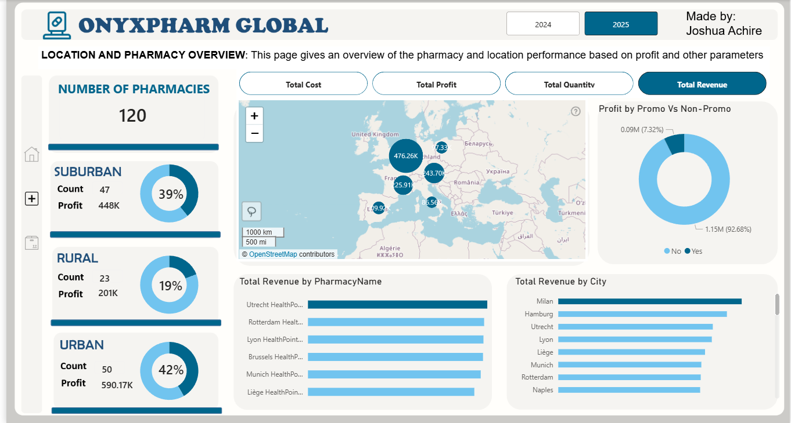
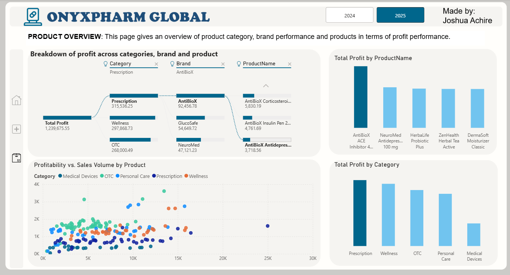

# 💊 OnyxPharm Global — Pharmaceutical Sales Dashboard
### OnyxData X ZoomCharts Challenge | Power BI

[](https://app.powerbi.com/view?r=eyJrIjoiMjJkN2EwMDMtYjgyYy00MGY2LTgxODQtNjU2MzE2Y2Q1ODcyIiwidCI6IjI1NzYyMjUxLTdhYTktNGM3Mi05MDVmLTM5YmYwMjZhOGE4NCIsImMiOjN9)


---

## 📌 Overview

This dashboard was built as part of the **OnyxData X ZoomCharts Power BI Challenge**. It provides a comprehensive performance analysis of **ONYXPHARM GLOBAL**, a retail pharmacy chain operating across **120 pharmacies** in multiple European countries.

Pharmacy chains face significant analytical gaps — fragmented visibility across regions, unclear profitability drivers, inconsistent promotional returns, and limited drill-down from country to individual pharmacy level. This report was designed to close those gaps and empower pharmacy leaders with actionable, data-driven insights.

---

## 📊 Dashboard Pages

### 1. Overview
High-level performance summary across all 120 pharmacies for 2024 vs 2025.


**Key Metrics:**
| Metric | Value | YOY Change |
|---|---|---|
| Total Revenue | 4.41M | ▲ 4.4% |
| Total Profit | 1.24M | ▲ 4.9% |
| Total Cost | 3.17M | ▲ 4.2% |
| Total Quantity | 228K | ▲ 4.7% |

> Quantity peaked in **May**, with a strong recovery in Q4. **Germany, Italy, and France** lead in sales volume. **OTC and Personal Care** are the dominant product categories.

---

### 2. Location & Pharmacy Overview
Geographical and pharmacy-level performance analysis.



**Highlights:**
- **Urban pharmacies** (50 locations) account for the highest share of profit at **42%**
- **Suburban pharmacies** (47 locations) contribute **39%** of profit
- **Rural pharmacies** (23 locations) contribute **19%** of profit
- **92.68%** of total profit comes from **non-promotional** sales, raising questions about the ROI of discounting strategies
- Top revenue-generating cities include **Milan, Hamburg, and Utrecht**

---

### 3. Product Overview
Category, brand, and product-level profitability deep dive.



**Highlights:**
- **Prescription** is the highest-grossing category (315K profit), followed by **Wellness** (297K)
- **AntiBioX** is the top-performing brand with the leading product being **AntiBioX Corticosteroi...**
- The profitability vs. sales volume scatter reveals several **high-volume, low-margin products** — a key area for margin optimization
- **Medical Devices** trail significantly in both profit and volume

---

## 🎯 Business Questions Addressed

- Which countries, cities, and pharmacies are driving the most value?
- How do urban, suburban, and rural locations differ in profitability?
- Are promotional strategies delivering measurable returns?
- Which product categories and brands are most profitable?
- What seasonal patterns should inform inventory and staffing decisions?
- Where are the high-volume, low-margin products hiding?

---

## 🛠️ Tools & Techniques

- **Power BI Desktop** — report development, data modeling, DAX measures
- **ZoomCharts Visuals** — enhanced interactivity and drill-through
- **DAX** — Year-over-year calculations, dynamic KPI measures, profit margin logic
- **Map Visualizations** — geographic distribution of revenue and profit

---

## 📁 Repository Structure

```
OnyxPharm-Global-Dashboard/
│
├── README.md
├── OnyxPharm_Global.pbix       # Power BI report file
└── images/
    ├── dashboard_overview.png
    ├── dashboard_location.png
    └── dashboard_product.png
```

---

## 🚀 How to Use

1. Clone or download this repository
2. Open `OnyxPharm_Global.pbix` in **Power BI Desktop**
3. Use the **2024 / 2025 toggle** to switch between years
4. Use the **metric tabs** (Total Cost, Total Profit, Total Quantity, Total Revenue) to explore different KPIs
5. Drill into any visual for pharmacy-level or product-level detail

---

## 👤 Author

**Joshua Achire**


[](https://www.linkedin.com/in/joshuaachire)

---


